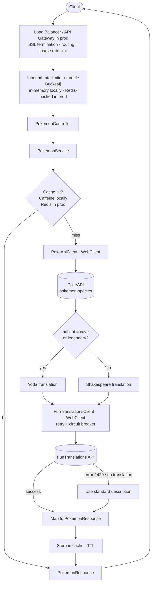

# funny-pokedex

A small REST "Pokedex" built for the TrueLayer Software Engineering Challenge 2026. It
exposes two endpoints that return Pokémon information, using two public APIs to do the
heavy lifting:

- [**PokéAPI**](https://pokeapi.co/) — standard description, habitat and legendary status
  (from the `pokemon-species` resource).
- [**FunTranslations**](https://api.funtranslations.mercxry.me/v1/) — Yoda / Shakespeare "fun"
  translations of the description.

Both upstreams are **rate-limited** (FunTranslations especially — a handful of calls per
hour on the free tier), so the design treats *protecting upstream quota* and *graceful
degradation* as first-class concerns rather than afterthoughts.

---

## Table of contents

- [API reference](#api-reference)
- [How to run it](#how-to-run-it)
- [Architecture](#architecture)
- [Request flow](#request-flow)
- [Domain mapping](#domain-mapping)
- [Caching strategy](#caching-strategy)
- [Production solutions](#production-solutions)
- [Testing strategy](#testing-strategy)
- [Project layout](#project-layout)
- [Tech stack](#tech-stack)

---

## API reference

### 1. Basic Pokémon information

```
GET /pokemon/{name}
```

```bash
http http://localhost:5000/pokemon/mewtwo
```

```json
{
  "name": "mewtwo",
  "description": "It was created by a scientist after years of horrific gene splicing and DNA engineering experiments.",
  "habitat": "rare",
  "isLegendary": true
}
```

### 2. Translated Pokémon description

```
GET /pokemon/translated/{name}
```

```bash
http http://localhost:5000/pokemon/translated/mewtwo
```

```json
{
  "name": "mewtwo",
  "description": "Created by a scientist after years of horrific gene splicing and dna engineering experiments, it was.",
  "habitat": "rare",
  "isLegendary": true
}
```

**Translation rules**

1. If the Pokémon's habitat is `cave` **or** it is legendary → **Yoda** translation.
2. Otherwise → **Shakespeare** translation.
3. If the translation cannot be obtained for any reason (upstream error, rate limit, empty
   result) → fall back to the **standard description**. The translated endpoint therefore
   always returns a usable response.

### Error responses

| Situation                       | Status | Body (shape)                                  |
| ------------------------------- | ------ | --------------------------------------------- |
| Unknown Pokémon name            | `404`  | `{ "error": "Pokemon 'xyz' not found" }`      |
| Inbound rate limit exceeded     | `429`  | `{ "error": "Rate limit exceeded" }`          |
| Upstream unavailable / breaker open | `503` | `{ "error": "Upstream temporarily unavailable" }` |

---

## How to run it

This section assumes a clean machine — nothing pre-installed beyond the prerequisites
below.

### Prerequisites

- **JDK 21** (the project targets Java 21). Verify with `java -version`.
- **Docker** (optional, for the container image and the Redis integration profile).
- Maven is **not** required globally — the project ships the Maven Wrapper (`./mvnw`),
  which downloads the correct Maven version on first use.

> The challenge examples use port **5000**, so the app is configured with
> `server.port=5000` in `application.properties`.

### Run locally (in-memory cache, no Redis needed)

```bash
./mvnw spring-boot:run
# then:
http http://localhost:5000/pokemon/mewtwo
http http://localhost:5000/pokemon/translated/mewtwo
```

The default (`local`) profile uses an **in-memory** cache, so no external services are
required to try the API.

### Build and run the jar

```bash
./mvnw clean package
java -jar target/pokedex-0.0.1-SNAPSHOT.jar
```

### Run with Docker

```bash
docker build -t funny-pokedex .
docker run -p 5000:5000 funny-pokedex
```

### Run with Docker Compose (app + Redis)

For the distributed setup, a `docker-compose.yml` brings up the app together with Redis:

```yaml
services:
  redis:
    image: redis:7-alpine
    ports:
      - "6379:6379"
  app:
    build: .
    ports:
      - "5000:5000"
    environment:
      - SPRING_PROFILES_ACTIVE=prod
      - SPRING_DATA_REDIS_HOST=redis
    depends_on:
      - redis
```

```bash
docker compose up --build
```

### Run the tests

```bash
./mvnw test      # unit tests (fast, no external dependencies)
./mvnw verify    # unit + integration tests (Redis via Testcontainers — needs Docker)
```

---

## Architecture

The project is small, so it uses a **layered (multi-tier) packaging** strategy — each tier
is a package under `com.eileanor.pokedex`, with dependencies pointing strictly inward
(controller → service → client → domain). This keeps responsibilities obvious and makes
the business logic easy to unit-test in isolation from HTTP and from the upstream APIs.

| Layer        | Package      | Responsibility |
| ------------ | ------------ | -------------- |
| **Controller** | `controller` | `PokemonController` defines the two HTTP endpoints. Thin — it only delegates to the service and returns DTOs. |
| **Service**    | `service`    | `PokemonService` (interface) + `PokemonServiceImpl`. Holds **all business logic**: orchestrating the client calls, selecting the English flavor text, choosing Yoda vs Shakespeare, applying the **translation→standard-description fallback**, and building the final entity. Caching decorates this layer. |
| **Client**     | `client`     | `PokeApiClient` and `FunTranslationsClient` issue the outbound HTTP requests with **`WebClient`** (one bean per upstream, each with its own base URL and timeouts). Outbound resilience (retry + circuit breaker) is applied here. |
| **Domain**     | `domain`     | Two groups of types: the **upstream response models** that deserialize PokéAPI / FunTranslations payloads, and the **API response DTO** (`PokemonResponse`) returned to our own clients. |
| **Error**      | `error`      | `PokemonNotFoundException`, `RateLimitExceededException`, and a `@RestControllerAdvice` (`GlobalExceptionHandler`) that maps exceptions to clean HTTP status codes and bodies. |

### A note on the HTTP client

The client layer is built on **`WebClient`** (reactive). The application itself stays a
standard servlet / Spring MVC app, so the service blocks on the reactive call at the
boundary (`.block()`). This is a deliberate choice over the `RestClient` that Spring
Initializr scaffolded: `WebClient` gives a richer, composable model that pairs cleanly with
Resilience4j's reactive operators for retry and circuit breaking, and it keeps the door
open to a fully non-blocking stack later. It requires adding `spring-boot-starter-webflux`.

---

## Request flow



> The LB / API Gateway and the Redis-backed Bucket4j are **production topology**. In local
> development, there is no gateway and Bucket4j uses an in-memory bucket — the rest of the
> flow is identical.

The basic `GET /pokemon/{name}` path is the same flow **without** the translation nodes
(`Rule → Yoda/Shakespeare → FunTranslations → Fallback`): it fetches from PokéAPI, maps,
caches and returns.

---

## Domain mapping

The upstream payloads are large; we only map what we need. The two example files in the
repo (`pokeapi-example.json`, `funtranslations-example.json`) drive these mappings.

### From PokéAPI `pokemon-species`

| Source field (PokéAPI)                                   | Our field        | Notes |
| -------------------------------------------------------- | ---------------- | ----- |
| `name`                                                   | `name`           | — |
| `flavor_text_entries[]` → first entry with `language.name == "en"` → `flavor_text` | `description` | Sanitize control characters: PokéAPI embeds `\n` and `\f` (form feed) inside the text — replace with spaces. |
| `habitat.name`                                           | `habitat`        | **Can be `null`** for some species (e.g. the example `ditto` species has a habitat, but newer species often don't). Map `null` → `null`/`"unknown"` rather than failing. |
| `is_legendary`                                           | `isLegendary`    | Used by the translation rule. |

### From FunTranslations

| Source field (FunTranslations)        | Usage |
| ------------------------------------- | ----- |
| `contents.translated`                 | The translated text. |
| `success.total`                       | If `0` (or HTTP `429` / any error), discard and fall back to the standard description. |

---

## Caching strategy

We cache the **derived result** — the final `PokemonResponse` — not the raw upstream
payloads. This is what actually matters: it shields the (heavily) rate-limited upstreams,
and it returns the exact object we serve.

- **Key:** Pokémon name, namespaced by endpoint (`basic:{name}` vs `translated:{name}`),
  so the two endpoints don't collide.
- **TTL:** configurable via application properties — there is no single right value, and it
  is the main lever for trading freshness against upstream load.

  ```properties
  app.cache.ttl=24h
  ```

The Spring Cache abstraction keeps the backend swappable by profile — no code change needed
when moving from local to production.

### Local development — Caffeine (in-memory)

The default `local` profile uses **Caffeine** as the cache backend. The JVM manages the
cache entirely in-heap; no external services are required to start the app or run tests.
Suitable for a single-process run where inter-instance coordination is not a concern.

### Production — Redis

In production the service runs as multiple replicas behind a load balancer. An in-memory
Caffeine cache would be **per-instance**: each replica would build its own independent
cache, fragmenting quota protection (Replica A's cached result is invisible to Replica B,
so both may end up calling the upstream). The `prod` profile instead uses
**Redis** (`spring-boot-starter-data-redis`) as a **shared distributed cache**, so all
instances see the same cached results and TTLs.

Because translations are deterministic for a given Pokémon and rarely change, a long TTL is
appropriate and dramatically reduces calls to the FunTranslations free tier.

---

## Production solutions

The challenge asks what we'd do differently for a production API. The core logic is the
same; the difference is everything around it. These are the decisions reflected in (or
recommended by) this design.

### Load balancer & API Gateway

In production, a **Load Balancer / API Gateway** sits in front of the application replicas
and handles:

- **SSL/TLS termination** — HTTPS offloaded at the edge; replicas communicate in plain
  HTTP inside the private network.
- **Routing** — distributes traffic across replicas (round-robin, least-connections, etc.)
  and supports blue/green or canary deployments without downtime.
- **Coarse-grained rate limiting** — high-volume DDoS traffic is dropped at the gateway
  before it reaches application threads. This is complementary to (not a replacement for)
  the app-level Bucket4j rate limiter, which enforces finer-grained per-client limits.

The app-level Bucket4j layer (see next subsection) handles nuanced per-key limits and
request throttling that the gateway's simpler per-IP limits cannot express.

### Distributed cache — Redis

See [Caching strategy → Production — Redis](#production--redis). In short: in-memory
Caffeine is used locally; **Redis** is used in production so the cache is shared across
all replicas and upstream quota protection is cluster-wide, not per-instance.

### Inbound/outbound security — rate limiting & throttling

To protect the service (and, transitively, our limited upstream quota) from abuse or
runaway clients, we add an inbound **rate limiter** implemented with **Bucket4j** as a
servlet filter. The inbound limiter uses a per-client-IP key so one misbehaving client exhausts only their own bucket. The outbound FunTranslations limiter uses a single global key shared across all instances, ensuring the entire cluster respects the upstream quota collectively rather than each replica enforcing it independently. Limits (requests/interval, burst size) are **configurable via application
properties**:

```properties
app.ratelimit.capacity=20
app.ratelimit.refill-period=1m
```

**Throttling** smooths bursts (token-bucket refill) so a spike of requests is shaped rather
than passed straight through to the upstreams. Excess requests get a clean `429`.

**Local development:** Bucket4j uses an **in-memory token bucket** — no external
dependency, but the rate limit is per-instance only.

**Production:** Bucket4j is backed by **Redis** (via the Bucket4j Redis integration) so
the token-bucket state is shared across all replicas. Without this, each replica would
independently allow `capacity` requests per period, effectively multiplying the limit by the
number of replicas — which defeats the purpose in a distributed deployment.

### Outbound resilience — retry + circuit breaker

The upstream APIs fail and rate-limit us, so the client layer wraps each call with
**Resilience4j**:

- **Retry** with exponential backoff for transient failures (timeouts, `5xx`) — but *not*
  for `429`, where retrying immediately would only burn more quota.
- **Circuit breaker** that opens when the **outbound rate limit / upstream `429`s** start
  hitting, failing fast instead of hammering a service that's already refusing us. While
  the breaker is open, the translated endpoint degrades gracefully to the standard
  description (rule 3), so callers still get a valid response.
- **Timeouts + bulkhead** to cap how many threads/connections a slow upstream can tie up.

### Redis availability — error handling

Redis is a shared dependency in production (both cache and rate-limiter state). A Redis
outage should degrade the service, not take it down entirely.

| Component | Redis down — behaviour | Trade-off |
| --------- | ---------------------- | --------- |
| **Cache** | Fall back to **Caffeine in-memory** per-instance (or bypass cache entirely and serve every request live from upstreams). | Upstream quota is exposed until Redis recovers; per-instance fallback still helps if the outage is partial. |
| **Bucket4j rate limiter** | **Fail-open**: fall back to a per-instance in-memory bucket. Requests are no longer cluster-wide rate-limited; each replica enforces the limit independently. | Prefer fail-open over fail-closed here — refusing all requests because Redis is down is worse than temporarily loosened limits. However, a partial mitigation (e.g. halved per-instance capacity during fallback) can be configured. |

Practically this means:

- The `CacheManager` bean is configured with Redis as primary and Caffeine as a fallback
  (or a `try/catch` around cache operations).
- Bucket4j's distributed setup uses a health-check on the Redis connection; if unavailable,
  the filter switches to a local fallback bucket and records a Micrometer counter so the
  fallback is observable.
- Spring Boot Actuator's `/actuator/health` exposes Redis connectivity as a health
  indicator; the orchestrator (Kubernetes, ECS) can use `/actuator/readiness` to stop
  routing traffic to a replica that has lost its Redis connection, rather than relying on
  the application to handle it gracefully on every request.

### Instrumentation & observability

To understand throughput and where time/errors go, the app exposes **Micrometer** metrics
scraped by **Prometheus** and visualized in **Grafana**, plus Spring Boot **Actuator** for
health/readiness probes. Key signals to watch:

- request throughput and latency (per endpoint),
- **cache hit ratio** (the headline metric — it's how we know quota is protected),
- upstream call count, latency and error rate (per upstream),
- **circuit-breaker state** transitions and retry counts.

### Other production notes

- **Externalized configuration & profiles** (`local`, `prod`) for all of the above
  tunables — no rebuild to change TTLs or limits.
- **Structured logging with correlation IDs** so a single request can be traced across the
  controller, service and both upstream calls.
- **Containerization & orchestration** — the Dockerfile produces a slim runtime image;
  horizontal scaling relies on the shared Redis cache described above.
- **Graceful degradation** — the translated endpoint is designed to *always* return
  something useful, never a hard failure, when translation is unavailable.

---

## Testing strategy

We favour a few high-value tests that exercise the logic that actually matters, over broad
shallow coverage.

- **Unit tests (service layer)** — the heart of the suite, with the clients mocked:
  - translation-rule selection (cave → Yoda, legendary → Yoda, otherwise Shakespeare),
  - **fallback** to the standard description when translation fails / is empty / rate-limited,
  - English flavor-text selection and `\n`/`\f` sanitization,
  - **null habitat** handling,
  - unknown Pokémon → `PokemonNotFoundException`.
- **Client tests** — `PokeApiClient` / `FunTranslationsClient` against a `MockWebServer`
  (or `WebClient` exchange mocks), covering deserialization and error/`429` mapping.
- **Integration tests** — `@SpringBootTest` end-to-end through the cache against
  **Testcontainers Redis**, asserting that a second request is served from cache (no second
  upstream call).

### Bonus (challenge)

- **Dockerfile** — included for containerized runs (see [How to run it](#how-to-run-it)).
- **Git history** — the repository preserves an incremental commit history showing the
  design and implementation evolving.

---

## Project layout

```
src/main/java/com/eileanor/pokedex/
├── PokedexApplication.java
├── controller/
│   └── PokemonController.java
├── service/
│   ├── PokemonService.java
│   └── PokemonServiceImpl.java
├── client/
│   ├── PokeApiClient.java
│   └── FunTranslationsClient.java
├── domain/
│   ├── pokeapi/            # upstream PokéAPI models (species, flavor text, habitat)
│   ├── funtranslations/    # upstream FunTranslations models
│   └── PokemonResponse.java   # the DTO we return
├── config/                 # WebClient, cache, rate-limiter, Resilience4j beans
└── error/
    ├── PokemonNotFoundException.java
    ├── RateLimitExceededException.java
    └── GlobalExceptionHandler.java
```

---

## Tech stack

| Concern          | Choice |
| ---------------- | ------ |
| Language / JDK   | Java 21 |
| Framework        | Spring Boot 4.1 (Spring MVC) |
| HTTP client      | Spring `WebClient` (`spring-webflux`) |
| Caching          | Spring Cache — **Caffeine** (local) / **Redis** (production) |
| Inbound limiting | Bucket4j — in-memory bucket (local) / **Redis-backed** (production) |
| Outbound resilience | Resilience4j (retry + circuit breaker + timeout) |
| Observability    | Micrometer + Prometheus + Grafana, Spring Actuator |
| Build            | Maven (`./mvnw` wrapper) |
| Boilerplate      | Lombok |
| Testing          | JUnit 5, MockWebServer, Testcontainers (Redis) |
| Packaging        | Dockerfile + docker-compose |
